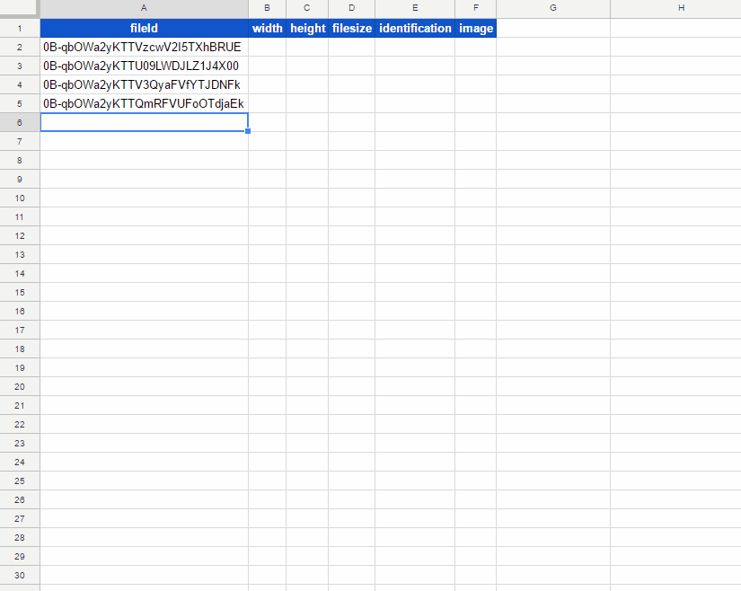
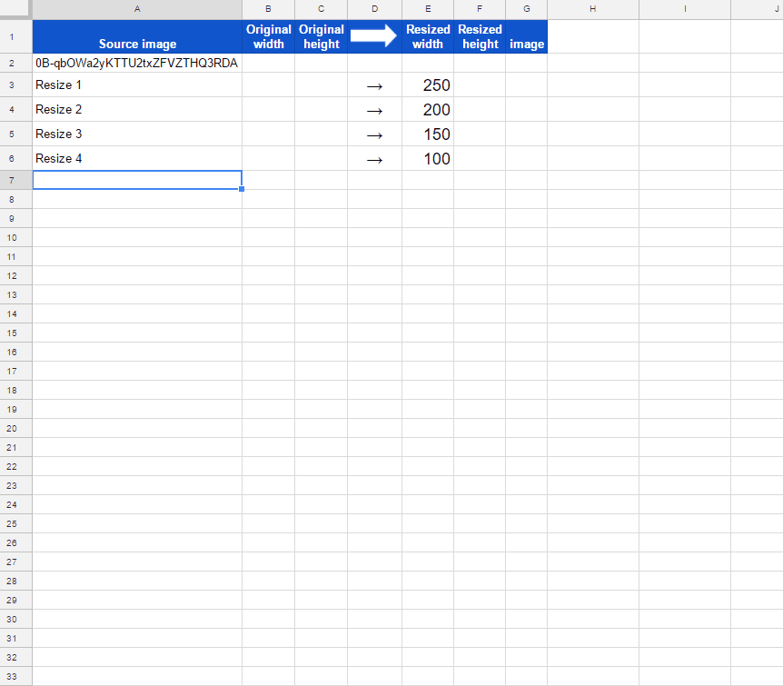
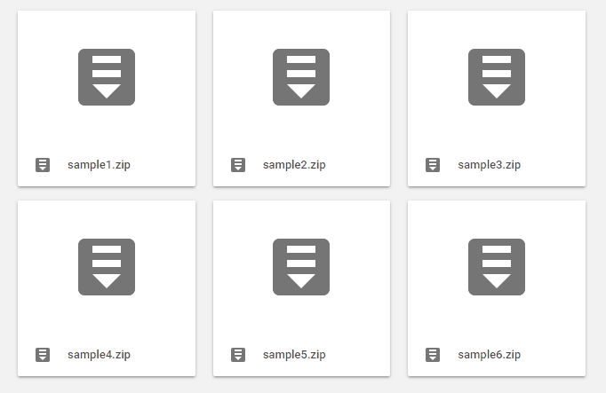

# ImgApp

This is a library of image tools for Google Apps Script.

## Methods
1. [getSize()](#getsize) : This method is for retrieving the width and height of image as the unit of pixel.
1. [doResize()](#doresize) : This method is for resizing images. The target files are Images, Movies, Google Docs, Microsoft Docs, Text and so on. About the detail information, please check [the principle of this method](#doresize_principle).
1. [updateThumbnail()](#updatethumbnail) : This method is for updating thumbnail of files on Google Drive.

I would like to add the methods for handling images in the future.

## How to install
- Open Script Editor. And please operate follows by click.
- -> Resource
- -> Library
- -> Input Script ID to text box. Script ID is **``1T03nYHRho6XMWYcaumClcWr6ble65mAT8OLJqRFJ5lukPVogAN2NDl-y``**.
- -> Add library
- -> Please select latest version
- -> Developer mode ON (If you don't want to use latest version, please select others.)
- -> Identifier is "**``ImgApp``**". This is set under the default.

[If you want to read about Libraries, please check this.](https://developers.google.com/apps-script/guide_libraries).

<u>** \* The method of ``doResize()`` uses Drive API. But, don't worry. Recently, I confirmed that users can use Drive API by only [the authorization for Google Services](https://developers.google.com/apps-script/guides/services/authorization). Users are not necessary to enable Drive API on Google API console. By the authorization for Google Services, Drive API is enabled automatically.**</u>

-----
# Methods

## 1. getSize()
### Overview
This method is for retrieving the width and height of image as the unit of pixel.

### Description
Unfortunately, there are no methods to directly retrieve the image size at Google Apps Script. As a workaround, there is a method that it imports the image in Google Document and retrieves the size using ``getWidth()`` and ``getHeight()``. [[A1](#retrieveusingdoc)] But in this method, it uses much time and resources on Google. So I thought of retrieving the information of image at the binary level, and created this. By this, the low process cost could be achieved.

### Demo

This is a demonstration for this method. the size information is retrieved from BMP, GIF, PNG and JPG files. **The play speed is the real time.** From this demo, you can see the speed for retrieving the size information from files.

This sample image is created by [k3-studio](http://k3-studio.deviantart.com/art/Overpass-413875385).

### Usage

~~~javascript
var blob = DriveApp.getFileById(fileId).getBlob();
var res = ImgApp.getSize(blob);
~~~

At first, please retrieve the file blob of image and give it to ``ImgApp.getSize()``. The results can be retrieved as JSON object like below.

~~~
res = {
        identification : ### BMP, GIF, PNG and JPG ###,
        width          : ### pixel ###,
        height         : ### pixel ###,
        filesize       : ### bytes ###
}
~~~

So if you want width and height, you can retrieve them using as follows.

~~~javascript
var blob = DriveApp.getFileById(fileId).getBlob();
var res = ImgApp.getSize(blob);
var width = res.width;
var height = res.height;
~~~

### Limitation
This method (``getSize()``) can retrieve the size information from BMP, GIF, PNG and JPG files.

-----

## 2. doResize()
### Overview
This method is for resizing images.

### Description
Unfortunately, there are no methods to resize images at Google Apps Script. As a workaround, there is a method that it imports the image in Google Document and resizes the image using ``setWidth()`` and ``setHeight()``. But in this method, the resized blob cannot be retrieved. So although I had thought of other workaround, I had not been able to find it. Recently, I accidentally discovered the other workaround ``doResize()``. Since it was found that this workaround can be surely used, I added this to ImgApp.

### Demo

This is a demonstration for this method. As a sample, at first, the size of source image is retrieved using ``getSize()``. Then, the source image is resized by the inputted width. **The play speed is the real time.**

This sample image is created by [k3-studio](http://k3-studio.deviantart.com/art/Chromatic-lituus-415318548).

### Usage

~~~javascript
var res = ImgApp.doResize(fileId, width);
~~~

- ``fileId`` (string) : File ID
- ``width`` (integer) : Resized width

About file ID, if you want to convert spreadsheet to an image, you can achieve it by inputting file ID of the spreadsheet. But there are some limitations. So please check [the limitations](#doresize_limitations).

The results can be retrieved as JSON object like below.

~~~
res = {
        blob           : blob,
        identification : ### BMP, GIF, PNG and JPG ###,
        originalwidth  : ### pixel ###,
        originalheight : ### pixel ###,
        resizedwidth   : ### pixel ###,
        resizedheight  : ### pixel ###
}
~~~

``blob`` is the blob of resized image. For example, if you want the width, height and the resized image as a file, you can retrieve them using as follows.

~~~javascript
var res = ImgApp.doResize(fileId, width);
var width = res.resizedwidth;
var height = res.resizedheight;
DriveApp.createFile(res.blob.setName("filename"));
~~~

### Principle
If this method had already been known, I apologize.

When I was investigating thumbnail using Drive API, I paid attention to one query in the link of thumbnail. The thumbnail link is different for Google Docs and files except for them as follows.

- Google Docs
    - ``https://docs.google.com/feeds/vt?gd=true&id=### fileId ###&v=##&s=#####&sz=s###``
- Files except for Google Docs
    - ``https://lh3.googleusercontent.com/#####=s###``

For these, I noticed a common point. It is **``=s###``** in the query parameters. It was found that this parameter meant the size of thumbnail for files as follows.

1. When the value of ``=s###`` is changed, the size of thumbnail is also changed.
1. For Google Docs (Spreadsheet, Document and Slide) and pdf files, ``=s###`` means the **height** (pixel) of thumbnail.
1. For files except for Google Docs, ``=s###`` means the **width** (pixel) of thumbnail.
1. For image and movie files, the maximum value of ``=s###`` is the same to the **original size of each image**.
1. For Google Docs, pdf, Microsoft Docs (Excel, Word and Powerpoint), Text and so on, the maximum value of ``=s###`` is **1024 pixel in the width**. <u>The aspect ratio is maintained.</u>

By above results, this method was created.

Although I also wanted to create this method at binary level, I gave up this by the problem of response speed due to the large amount of calculation.

### Limitations
This method (``doResize()``) cannot resize over the original size of the source file. Namely, this cannot magnify the images.

1. For image and movie files, the maximum size is the same to the **original size of each image**.
1. For Google Docs, pdf, Microsoft Docs (Excel, Word and Powerpoint), Text and so on, the maximum size is **1024 pixel in the width**. The aspect ratio is maintained.
1. The thumbnail of standalone Google Apps Script cannot be retrieved.

-----

## 3. updateThumbnail()
### Overview
This method is for updating thumbnail of files on Google Drive using images you selected.

### Description
For example, zip files don't have the thumbnail on Google Drive. An icon is shown as the thumbnail. For the most files, Google Drive can create automatically each thumbnail. But there are sometimes files which cannot be created the thumbnail. Zip file is also one of them. In order to add and update thumbnails to such files, I added this method.

### Demo

This is a demonstration for this method. The thumbnails of zip files are updated.

This sample images are created by [k3-studio](http://k3-studio.deviantart.com).

### Usage

~~~javascript
var res = ImgApp.updateThumbnail(imgFileId, srcFileId);
~~~

- ``imgFileId`` (string) : File ID of new thumbnail image on Google Drive
- ``srcFileId`` (integer) : File ID of file, which is updated thumbnail, on Google Drive

The results can be retrieved as JSON object like below.

~~~
res = {
    "id": "### file id ###",
    "name": "### file name ###",
    "mimeType": "### mimeType ###",
    "thumbnailLink": "### thumbnail link ###",
    "thumbnailVersion": "#"
}
~~~

This method uses multipart-POST request. If you want to know about this, please check [here](https://gist.github.com/tanaikech/d595d30a592979bbf0c692d1193d260c).

### Limitations
You can use PNG, JPEG and GIF files as the thumbnail image. And there are some limitations for updating thumbnail. Please confirm the detail information [here](https://developers.google.com/drive/v3/web/file#uploading_thumbnails). Especially following limitations are important for using this method.

- **If Drive can generate a thumbnail from the file, then it will use the generated one and ignore any you may have uploaded.**
    - Although I used this script to Google Docs and images, the updated image was not reflected to them. It is considered that this is the limitation.
- If it can't generate a thumbnail, it will always use yours if you provided one.
    - ``hasThumbnail`` of zip files is false. So zip files can update the thumbnail.

### Note
In my environment, at the first update, the update had sometimes been failed. But at that time, the second update had worked fine. I don’t know about the reason. I’m sorry.

-----

# Appendix

## 1. Retrieving Image Size using Google Document
~~~javascript
function getSize_doc(blob) {
  var docfile = Drive.Files.insert({
    title: "temp",
    mimeType: "application/vnd.google-apps.document",
  }).getId();
  var img = DocumentApp.openById(docfile).insertImage(0, blob);
  Drive.Files.remove(docfile);
  return {width: img.getWidth(), height: img.getHeight()};
}
~~~

# Contact
If you found bugs, limitations and you have questions, feel free to mail me.

e-mail: tanaike@hotmail.com

# Update History
* v1.0.0 (June 27, 2017)

    Initial release.
    Added [getSize()](#getsize)

* v1.1.0 (June 29, 2017)

    Added new method.
    Added [doResize()](#doresize)

* v1.2.0 (August 20, 2017)

    Added new method.
    Added [updateThumbnail()](#updatethumbnail)

[TOP](#TOP)
