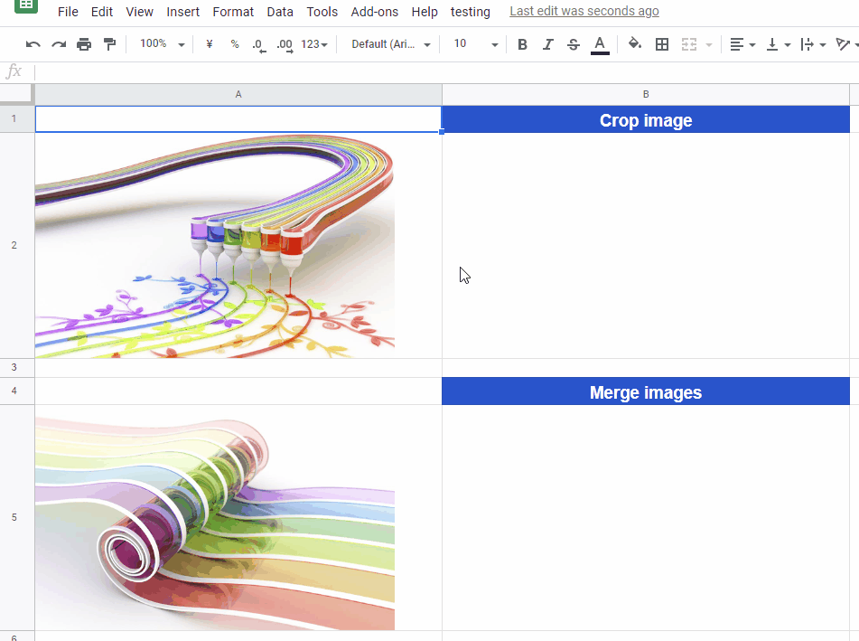

<a name="top"></a>

# ImgApp

[](https://codeclimate.com/github/tanaikech/ImgApp)
[](https://codeclimate.com/github/tanaikech/ImgApp)
[](LICENCE)

This is a library of image tools for Google Apps Script.

## Methods

1. [getSize()](#getsize) : This method is for retrieving the width and height of image as the unit of pixel.

2. [doResize()](#doresize) : This method is for resizing images. The target files are Images, Movies, Google Docs, Microsoft Docs, Text and so on. About the detail information, please check [the principle of this method](#doresize_principle).

3. [updateThumbnail()](#updatethumbnail) : This method is for updating thumbnail of files on Google Drive.

4. [editImage()](#editimage) : Edit an image. The image can be cropped. And also, the several images can be merged as an image.

I would like to add the methods for handling images in the future.

## How to install

- Open Script Editor. And please operate follows by click.
- -> Resource
- -> Library
- -> Input Script ID to text box. Script ID is **`1T03nYHRho6XMWYcaumClcWr6ble65mAT8OLJqRFJ5lukPVogAN2NDl-y`**.
- -> Add library
- -> Please select latest version
- -> Developer mode ON (If you don't want to use latest version, please select others.)
- -> Identifier is "**`ImgApp`**". This is set under the default.

[If you want to read about Libraries, please check this.](https://developers.google.com/apps-script/guide_libraries).

<u>** \* The method of `doResize()` uses Drive API. But, don't worry. Recently, I confirmed that users can use Drive API by only [the authorization for Google Services](https://developers.google.com/apps-script/guides/services/authorization). Users are not necessary to enable Drive API on Google API console. By the authorization for Google Services, Drive API is enabled automatically.**</u>

---

# Methods

<a name="getsize"></a>

## 1. getSize()

### Overview

This method is for retrieving the width and height of image as the unit of pixel.

### Description

Unfortunately, there are no methods to directly retrieve the image size at Google Apps Script. As a workaround, there is a method that it imports the image in Google Document and retrieves the size using `getWidth()` and `getHeight()`. [[A1](#retrieveusingdoc)] But in this method, it uses much time and resources on Google. So I thought of retrieving the information of image at the binary level, and created this. By this, the low process cost could be achieved.

### Demo


This is a demonstration for this method. the size information is retrieved from BMP, GIF, PNG and JPG files. **The play speed is the real time.** From this demo, you can see the speed for retrieving the size information from files.

This sample image is created by [k3-studio](http://k3-studio.deviantart.com/art/Overpass-413875385).

### Usage

```javascript
var blob = DriveApp.getFileById(fileId).getBlob();
var res = ImgApp.getSize(blob);
```

At first, please retrieve the file blob of image and give it to `ImgApp.getSize()`. The results can be retrieved as JSON object like below.

```
res = {
        identification : ### BMP, GIF, PNG and JPG ###,
        width          : ### pixel ###,
        height         : ### pixel ###,
        filesize       : ### bytes ###
}
```

So if you want width and height, you can retrieve them using as follows.

```javascript
var blob = DriveApp.getFileById(fileId).getBlob();
var res = ImgApp.getSize(blob);
var width = res.width;
var height = res.height;
```

### Limitation

This method (`getSize()`) can retrieve the size information from BMP, GIF, PNG and JPG files.

---

<a name="doresize"></a>

## 2. doResize()

### Overview

This method is for resizing images.

### Description

Unfortunately, there are no methods to resize images at Google Apps Script. As a workaround, there is a method that it imports the image in Google Document and resizes the image using `setWidth()` and `setHeight()`. But in this method, the resized blob cannot be retrieved. So although I had thought of other workaround, I had not been able to find it. Recently, I accidentally discovered the other workaround `doResize()`. Since it was found that this workaround can be surely used, I added this to ImgApp.

### Demo


This is a demonstration for this method. As a sample, at first, the size of source image is retrieved using `getSize()`. Then, the source image is resized by the inputted width. **The play speed is the real time.**

This sample image is created by [k3-studio](http://k3-studio.deviantart.com/art/Chromatic-lituus-415318548).

### Usage

```javascript
var res = ImgApp.doResize(fileId, width);
```

- `fileId` (string) : File ID
- `width` (integer) : Resized width

About file ID, if you want to convert spreadsheet to an image, you can achieve it by inputting file ID of the spreadsheet. But there are some limitations. So please check [the limitations](#doresizelimitations).

The results can be retrieved as JSON object like below.

```
res = {
        blob           : blob,
        identification : ### BMP, GIF, PNG and JPG ###,
        originalwidth  : ### pixel ###,
        originalheight : ### pixel ###,
        resizedwidth   : ### pixel ###,
        resizedheight  : ### pixel ###
}
```

`blob` is the blob of resized image. For example, if you want the width, height and the resized image as a file, you can retrieve them using as follows.

```javascript
var res = ImgApp.doResize(fileId, width);
var width = res.resizedwidth;
var height = res.resizedheight;
DriveApp.createFile(res.blob.setName("filename"));
```

<a name="doresize_principle"></a>

### Principle

If this method had already been known, I apologize.

When I was investigating thumbnail using Drive API, I paid attention to one query in the link of thumbnail. The thumbnail link is different for Google Docs and files except for them as follows.

- Google Docs
  - `https://docs.google.com/feeds/vt?gd=true&id=### fileId ###&v=##&s=#####&sz=s###`
- Files except for Google Docs
  - `https://lh3.googleusercontent.com/#####=s###`

For these, I noticed a common point. It is **`=s###`** in the query parameters. It was found that this parameter meant the size of thumbnail for files as follows.

1. When the value of `=s###` is changed, the size of thumbnail is also changed.
1. For Google Docs (Spreadsheet, Document and Slide) and pdf files, `=s###` means the **height** (pixel) of thumbnail.
1. For files except for Google Docs, `=s###` means the **width** (pixel) of thumbnail.
1. For image and movie files, the maximum value of `=s###` is the same to the **original size of each image**.
1. For Google Docs, pdf, Microsoft Docs (Excel, Word and Powerpoint), Text and so on, the maximum value of `=s###` is **1024 pixel in the width**. <u>The aspect ratio is maintained.</u>

By above results, this method was created.

Although I also wanted to create this method at binary level, I gave up this by the problem of response speed due to the large amount of calculation.

<a name="doresizelimitations"></a>

### Limitations

This method (`doResize()`) cannot resize over the original size of the source file. Namely, this cannot magnify the images.

1. For image and movie files, the maximum size is the same to the **original size of each image**.
1. For Google Docs, pdf, Microsoft Docs (Excel, Word and Powerpoint), Text and so on, the maximum size is **1024 pixel in the width**. The aspect ratio is maintained.
1. The thumbnail of standalone Google Apps Script cannot be retrieved.

---

<a name="updatethumbnail"></a>

## 3. updateThumbnail()

### Overview

This method is for updating thumbnail of files on Google Drive using images you selected.

### Description

For example, zip files don't have the thumbnail on Google Drive. An icon is shown as the thumbnail. For the most files, Google Drive can create automatically each thumbnail. But there are sometimes files which cannot be created the thumbnail. Zip file is also one of them. In order to add and update thumbnails to such files, I added this method.

### Demo


This is a demonstration for this method. The thumbnails of zip files are updated.

This sample images are created by [k3-studio](http://k3-studio.deviantart.com).

### Usage

```javascript
var res = ImgApp.updateThumbnail(imgFileId, srcFileId);
```

- `imgFileId` (string) : File ID of new thumbnail image on Google Drive
- `srcFileId` (string) : File ID of file, which is updated thumbnail, on Google Drive

The results can be retrieved as JSON object like below.

```
res = {
    "id": "### file id ###",
    "name": "### file name ###",
    "mimeType": "### mimeType ###",
    "thumbnailLink": "### thumbnail link ###",
    "thumbnailVersion": "#"
}
```

This method uses multipart-POST request. If you want to know about this, please check [here](https://gist.github.com/tanaikech/d595d30a592979bbf0c692d1193d260c).

<a name="updatethumbnail_limitations"></a>

### Limitations

You can use PNG, JPEG and GIF files as the thumbnail image. And there are some limitations for updating thumbnail. Please confirm the detail information [here](https://developers.google.com/drive/v3/web/file#uploading_thumbnails). Especially following limitations are important for using this method.

- **If Drive can generate a thumbnail from the file, then it will use the generated one and ignore any you may have uploaded.**
  - Although I used this script to Google Docs and images, the updated image was not reflected to them. It is considered that this is the limitation.
- If it can't generate a thumbnail, it will always use yours if you provided one.
  - `hasThumbnail` of zip files is false. So zip files can update the thumbnail.

### Note

In my environment, at the first update, the update had sometimes been failed. But at that time, the second update had worked fine. I don’t know about the reason. I’m sorry.

---

<a name="editimage"></a>

## 4. editImage()

In this method, it is required to use the following scopes and APIs.

- Scope: `https://www.googleapis.com/auth/presentations`
- APIs: Drive API and Slides API.
  - Please enable both Drive API and Slides API at Advanced Google services. [Ref](https://developers.google.com/apps-script/guides/services/advanced#enabling_advanced_services)

### Overview

This method is for editing images. In the current stage, the image can be cropped. And several images can be merged as an image.

### Description

In the current stage, the image cannot be cropped and retrieved the cropped image as a blob, and also, several images cannot be merged as one image using Google Apps Script. In this method, these can be achieved. The flows are as follows.

### Demo



- The sample image of cell "A2" is from [https://www.deviantart.com/k3-studio/art/Rainbow-painting-281090729](https://www.deviantart.com/k3-studio/art/Rainbow-painting-281090729)
- The sample image of cell "A5" is from [https://www.deviantart.com/k3-studio/art/Chromatic-lituus-415318548](https://www.deviantart.com/k3-studio/art/Chromatic-lituus-415318548)

#### For cropping image

1. Create new Google Slides with the custom pagesize.
   - In this case, I used a library of [DocsServiceApp](https://github.com/tanaikech/DocsServiceApp).
2. Put an image to the Google Slides.
   - By this, the slide with the custom pagesize can be used as a window for showing image.
3. Export the slide as an image.

#### For merging images

1. Retrieve the image size from all images for merging.
2. Create new Google Slides with the custom pagesize using the retrieved image size.
   - In this case, I used a library of [DocsServiceApp](https://github.com/tanaikech/DocsServiceApp).
3. Put an image to the Google Slides.
   - By this, the slide with the custom pagesize can be used as a window for showing image.
4. Export the slide as an image.

### Usage: Crop image

```javascript
const object = {
  blob: imageBlob, // Please set the blob of the image.
  unit: "pixel",
  crop: { t: 50, b: 100, l: 200, r: 100 },
  outputWidth: 800,
};
const blob = ImgApp.editImage(object);
// DriveApp.createFile(blob); // When this line is used, the output image is put to the root folder as a file.
```

- `blob` (Blob) : Blob of the image.
- `unit` (String) : Unit for using this method. You can select one from `pixel` and `point`.
- `crop` (Object) : `t`, `b`, `l` and `r` are the size from top, bottom, left and right, respectively. In this case, when `unit` is "pixel", this is used as the pixel.
- `outputWidth` (Integer) : Size of width of output image. In this case, when `unit` is "pixel", this is used as the pixel.

The results can be retrieved as Blob.

### Usage: Merge images

```javascript
const object = {
  merge: [
    [imageBlob1, imageBlob2],
    [imageBlob3, null],
  ], // Please set the blob of the image.
  outputWidth: 800,
  outputFilename: "sample.png",
};
const blob = ImgApp.editImage(object);
// DriveApp.createFile(blob); // When this line is used, the output image is put to the root folder as a file.
```

- `merge` (Blob[][]) : 2 dimensional array including the image Blobs.
  - If you don't want to put the image, at that time, please put `null` instead of the blob.
- `outputWidth` (Integer) : Size of width of output image. In this case, the unit is "pixel".
- `outputFilename` (String) : Filename of output blob.

The results can be retrieved as Blob.

### Limitations

- In this case, the maximum size of width of output image is 1,600 pixel. This is due to the limitation of [this](https://developers.google.com/slides/reference/rest/v1/presentations.pages/getThumbnail).
- The maximum image size which can use for this method is required to be less than `25,000,000 pixels^2`. Please be careful this. [Ref](https://gist.github.com/tanaikech/9414d22de2ff30216269ca7be4bce462)

---

# Appendix

<a name="retrieveusingdoc"></a>

## 1. Retrieving Image Size using Google Document

```javascript
function getSize_doc(blob) {
  var docfile = Drive.Files.insert({
    title: "temp",
    mimeType: "application/vnd.google-apps.document",
  }).getId();
  var img = DocumentApp.openById(docfile).insertImage(0, blob);
  Drive.Files.remove(docfile);
  return { width: img.getWidth(), height: img.getHeight() };
}
```

## 2. Inserting Text on Image using Google Apps Script

This is a sample script for inserting a text on an image using Google Apps Script.

- [https://gist.github.com/tanaikech/835642df109731a559e52d831bd3342d](https://gist.github.com/tanaikech/835642df109731a559e52d831bd3342d)

## 3. Reducing Image Data Size using Google Apps Script

This is a sample script for reducing the image data size using Google Apps Script. You might have a situation where you might want to reduce the data size of image data using Google Apps Script. Here, using Google Apps Script, I would like to introduce a sample script for reducing the data size of the image data by reducing the image quality.

- [https://gist.github.com/tanaikech/14c863e225162ec86894d604709d8b35](https://gist.github.com/tanaikech/14c863e225162ec86894d604709d8b35)

---

<a name="licence"></a>

# Licence

[MIT](LICENCE)

<a name="author"></a>

# Author

[Tanaike](https://tanaikech.github.io/about/)

# Update History

- v1.0.0 (June 27, 2017)

  Initial release.
  Added [getSize()](#getsize)

- v1.1.0 (June 29, 2017)

  Added new method.
  Added [doResize()](#doresize)

- v1.2.0 (August 20, 2017)

  Added new method.
  Added [updateThumbnail()](#updatethumbnail)

- v1.2.1 (November 5, 2018)

  Efficiency of each loop was enhanced by [this benchmark](https://gist.github.com/tanaikech/848aeafaac1ec676900bb78e3ce220b6).

- v1.2.2 (April 6, 2019)

  By Google's update, the error of "Malformed multipart body." occurs. This error was resolved.

- v1.2.3 (January 14, 2020)

  Error message was added by [https://github.com/tanaikech/ImgApp/issues/5](https://github.com/tanaikech/ImgApp/issues/5)

- v1.3.0 (September 24, 2020)

  Added new method.
  Added [editImage()](#editimage)

[TOP](#top)
